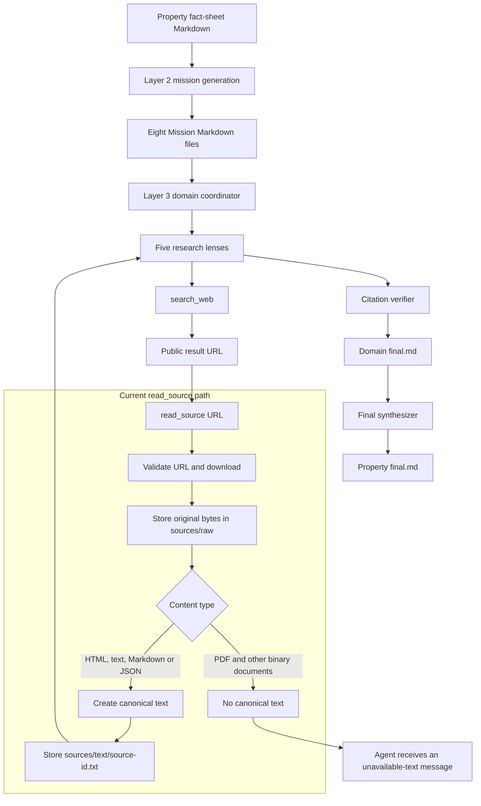
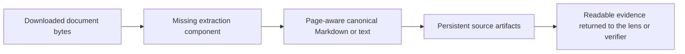
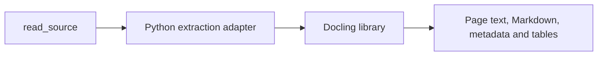
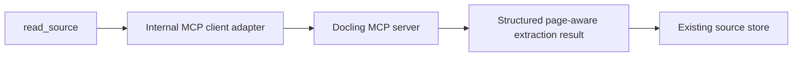
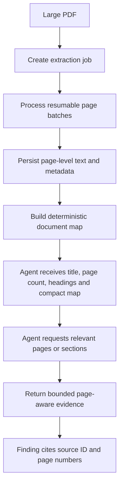

# Document Extraction Architecture — Second-Opinion Brief

## Purpose

This brief requests a second opinion on how document extraction should be added to the CDI deep-research pipeline.

The unresolved decision is whether to:

1. Integrate Docling directly into the Python application.
2. Use a Docling MCP server as an external document-processing boundary.
3. Use another minimal architecture that is more reliable for large PDFs and future document formats.

No implementation decision has been made. The objective is to select the smallest robust design before changing the codebase.

## Existing deep-research architecture



## Exact current problem

The pipeline successfully downloads and hashes a PDF, but it does not extract its contents.

Current path:

```text
search_web finds an official PDF
        ↓
read_source downloads the PDF
        ↓
Original bytes are stored as sources/raw/<prefix>/<sha256>.bin
        ↓
canonical_text() receives content type application/pdf
        ↓
canonical_text() returns None
        ↓
No sources/text/<sha256>.txt artifact is created
        ↓
The research agent cannot read or verify the document
```

Relevant code:

- `ML/deep_research/layer3/research_tools.py`: `read_source` fetches the URL and calls the source store.
- `ML/deep_research/layer3/sources.py`: `SourceStore.store()` saves raw bytes and requests canonical text.
- `ML/deep_research/layer3/text_extraction.py`: `canonical_text()` supports HTML, plain text, Markdown and JSON, but returns `None` for PDFs and other formats.
- `ML/deep_research/layer3/settings.py`: one fetched source is currently limited to 10 MiB.

The missing component belongs inside the `read_source` evidence-preparation path:



It is not a new research agent, Layer 2 stage, risk-classification stage or synthesis stage.

## Existing architectural boundaries to preserve

- The original downloaded bytes remain the authoritative source artifact.
- Extraction is deterministic evidence preparation, not LLM-authored research.
- The five research lenses and citation verifier retain only `search_web` and `read_source` as model-visible tools unless a strong reason exists to change that contract.
- The final synthesizer has no web or source-reading tools.
- Extracted content must retain source identity and page-level provenance.
- Re-reading a processed source should reuse local artifacts instead of downloading or extracting it again.
- Extraction failures must be visible but must not block available sibling research outputs.
- The extraction layer must not grade, rewrite, repair or validate the model's final research output.
- Existing run folders and completed runs must remain unchanged.

## Decision option A — direct Python integration

Docling would run in the same Python process or through a small internal adapter called by `SourceStore.store()`.



Potential advantages:

- Smallest runtime architecture.
- No MCP server lifecycle, network hop or separate authentication boundary.
- Direct access to the existing run folder and source cache.
- Easier atomic writes and checkpoint integration.
- Simple for one Python application and one deployment unit.

Potential disadvantages:

- Heavy document dependencies become part of the research application's environment.
- OCR and document conversion may consume substantial CPU, memory and startup time.
- A crash or memory spike occurs inside the research worker unless processing is isolated.
- Reuse by other applications requires importing the same Python package and conventions.

## Decision option B — Docling MCP

Document conversion would be owned by a separately running MCP server. The application would call it from inside the existing evidence layer.



The MCP call does not necessarily need to become a model-visible tool. It can remain an internal implementation detail beneath `read_source`, preserving the existing agent tool contract.

Potential advantages:

- Document processing is isolated from the research worker.
- One extraction service can support multiple applications or workers.
- Dependency and resource management can be separated from the agent harness.
- The service can independently scale CPU/OCR workers and enforce job limits.

Potential disadvantages:

- Additional deployment, monitoring, authentication and failure handling.
- A second service and protocol are unnecessary if only this application uses extraction.
- Large document transfer through MCP may be inefficient if raw bytes or full Markdown are repeatedly transported.
- File-path access becomes difficult when the MCP server and research worker do not share storage.
- The particular Docling MCP implementation must be checked for page selection, OCR configuration, table output, artifact persistence, cancellation and resume support; the MCP label alone does not guarantee these features.

## Decision option C — extraction worker with a narrow internal interface

An alternative is a local or service-based extraction worker behind a small application-owned interface. It may use Docling internally without exposing Docling-specific details to the research pipeline.

```text
ingest source → persistent extraction manifest
list pages/sections → lightweight document map
read selected pages/sections → bounded evidence returned to the agent
```

This provides isolation and large-document control but introduces a service boundary similar to MCP. It should be selected only if the MCP implementation cannot provide the required artifact and retrieval contract.

## Large PDF problem

Sending the full extracted text of a large PDF to the model in one `read_source` response is unsafe and unnecessarily expensive.

Examples:

- A 500-page planning file may contain hundreds of thousands of tokens.
- OCR may produce more text than the original embedded-text layer.
- Tables, appendices and repeated headers can inflate context.
- One large `read_source` response can occupy most of an agent's working context before compaction can help.
- The current 10 MiB download limit can reject a useful PDF before extraction begins.

The preferred behavior is ingest once, retrieve selectively:



### Proposed large-document properties

- Extract and persist content once per source hash.
- Process large documents in resumable page batches.
- Store a manifest with source ID, media type, page count, extraction status, extractor version and errors.
- Store page-aware text rather than one undifferentiated text blob.
- Preserve page numbers, headings, tables and reading order where available.
- Return a compact document map first when the full text is too large.
- Allow the agent to request specific pages or sections through `read_source` rather than receiving the entire document automatically.
- Keep exact extracted page content available for citation verification.
- Reuse extracted artifacts during retries and checkpoint resumes.
- Make OCR language configuration explicit for expected English, German and French documents.
- Record partial extraction when individual pages fail instead of discarding the complete document.
- Separate raw-download limits, extraction-resource limits and model-context limits.
- Avoid sending raw binary content through the LLM context.

## Possible artifact layout

This is a design candidate, not an approved schema:

```text
sources/
├── raw/
│   └── ab/<source-id>.bin
├── documents/
│   └── <source-id>/
│       ├── manifest.json
│       ├── document.md
│       ├── pages/
│       │   ├── 0001.md
│       │   ├── 0002.md
│       │   └── ...
│       └── tables/
│           └── ...
└── index.jsonl
```

An alternative is one structured Docling JSON artifact plus a lightweight page index. The second opinion should identify the smallest sufficient artifact design.

## Questions requiring a second opinion

Please evaluate the current code and answer the following.

### Architecture boundary

1. Should Docling run directly in the existing Python process, in a worker process, or behind an MCP server?
2. Does a production-ready Docling MCP implementation already provide the required page-aware extraction, OCR, table handling, caching and resume behavior?
3. Should MCP remain internal beneath `read_source`, or should the model call Docling MCP tools directly?
4. What concrete benefit would MCP provide for this single repository today?
5. At what deployment scale would MCP become preferable to direct integration?

### Large documents

6. What is the correct retrieval contract for a 500–2,000-page PDF?
7. Should the first response contain a document map, selected pages, deterministic text-search results or another representation?
8. How should an agent request additional pages without losing its prior research context?
9. How should extraction resume after failure without reprocessing successful pages?
10. How should oversized sources above the current 10 MiB fetch limit be downloaded safely?
11. Which limits should apply to download size, page count, OCR work, stored artifacts and one `read_source` response?

### Evidence and provenance

12. Which Docling outputs preserve page numbers and table provenance reliably enough for citations?
13. Should canonical evidence be Markdown, Docling JSON, per-page text or a combination?
14. How should scanned pages, mixed embedded text and OCR output be distinguished?
15. How should partial, unreadable, encrypted or malformed documents be represented without silently dropping them?
16. How should extractor version changes affect cached artifacts and reproducibility?

### Format coverage

17. Should the first implementation support only PDFs, or also DOCX and PPTX through the same boundary?
18. Should spreadsheets remain outside Docling and use a dedicated XLSX pipeline?
19. Which formats should be explicitly unsupported rather than handled unreliably?

### Operations and security

20. What isolation is required for untrusted public documents?
21. How should decompression bombs, malformed files, excessive OCR work and parser crashes be contained?
22. If MCP is used, how should transport, authentication, timeouts, cancellation and shared-file access work?
23. Should the service receive a URL, raw bytes, a local path or an object-storage reference?
24. How can raw documents remain private and avoid accidental transfer to an external public service?

## Requested second-opinion output

Please return:

1. A direct recommendation: direct Python integration, Docling MCP, worker/service, or another design.
2. The reasons for that recommendation for this specific repository.
3. A minimal component and call-flow diagram.
4. A proposed large-PDF ingestion and selective-reading contract.
5. The minimum persistent artifact schema needed for provenance and resume.
6. Failure handling for partial extraction, OCR errors and oversized files.
7. Security and deployment implications.
8. A staged implementation plan, separating the smallest safe first version from later scaling work.
9. Any incorrect assumptions or missing concerns in this brief.

## Initial recommendation to challenge

The current working recommendation is:

- Keep `search_web` and `read_source` as the only model-visible evidence tools.
- Put document extraction underneath `read_source`.
- Preserve original bytes and page-aware extracted artifacts by source hash.
- For this single Python repository, start with the smallest local Docling adapter or isolated worker rather than deploying an MCP service solely for architectural neatness.
- Use MCP only if it demonstrably provides a maintained extraction service needed by multiple workers or applications, or materially improves isolation and scaling.
- Never send an entire very large PDF to the model. Return a document map and allow selective, page-aware reading.
- Keep spreadsheets on a dedicated extraction path unless evidence shows Docling preserves spreadsheet semantics required by the product.

This recommendation is deliberately provisional and should be challenged with concrete implementation and operational evidence.

